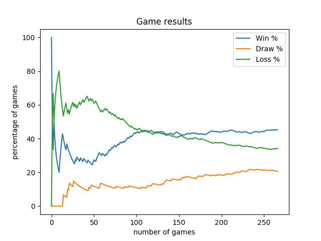
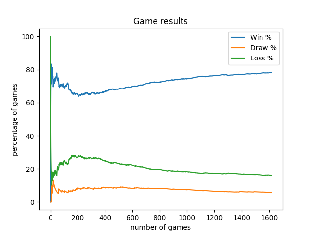

Starcraft2 Nidup's agents
=========================

Starcraft2 agents using Reinforcement Learning and [Deepmind PySC2](https://github.com/deepmind/pysc2) - StarCraft II Learning Environment 🤖

These agents have been built to work properly on the Simple64 map, as a Terran player.

They are not robust enough to play elsewhere.

All the following data have been collected playing against the built-in AI.

Idea is to progressively raise the built-in AI difficulty mode using a more rich / complex / adaptive agent.

Agents can be installed following [this doc](doc/install.md).

Basic agents (scripted)
-----------------------

Here are [few scripted agents](doc/scripted_agents.md) (built to discover the API).

Reinforcement Marine Agent (Machine Learning - Generation 1)
------------------------------------------------------------

This agent uses a Q-Learning table, a reduced set of actions (build supply depot, barrack, train marine & attack) and a sparse reward depending on the result of the episode.
It has been slightly fine-tuned to be trained faster and win more games against the built-in AI.
[Here are more details on training, attempts and evolution](doc/reinforcement_marine_agent.md).

**Against [very-easy built-in AI](https://github.com/deepmind/pysc2/blob/master/pysc2/env/sc2_env.py#L51)**



Hybrid Reinforcement Attack Agent (Machine Learning - Generation 2)
-------------------------------------------------------------------

This agent uses the same Q-Learning approach but specialized on the train units & attack phase.
The build order phase is scripted to reduce the set of actions and focus the training on the attack.
The build order and actions are enriched to train marines & marauders.
[Here are more details on training, attempts and evolution](doc/reinforcement_attack_agent.md).

**Against [easy built-in AI](https://github.com/deepmind/pysc2/blob/master/pysc2/env/sc2_env.py#L51)**



```
Results on the 100 last games:
race	total	win	draw	loss	win %	draw %	loss %
zerg	24	23	0	1	95.83	0	4.17
terran	38	35	1	2	92.11	2.63	5.26
protoss	33	28	0	5	84.85	0	15.15
```

Multi Reinforcement Agent (Machine Learning - Generation 3)
-----------------------------------------------------------

This agent uses the same Q-Learning approach, however, it specializes learning on several aspects, as build orders and attack phases.

[WIP]


Data & Analysis
---------------

The game results are stored in `data` folder using a different file per agent.

The file is suffixed by `_results` and contains a pandas DataFrame.

Generate the result report graph:
```
$ python3.6 generate_report.py --agent-name nidup.pysc2.agents.ReinforcementMarineAgent
```

Query the game results:
```
$ python3.6 generate_report.py --agent-name nidup.pysc2.agents.ReinforcementMarineAgent --filter win
```
