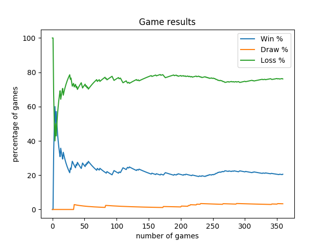
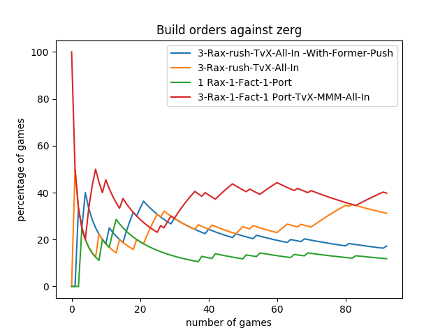
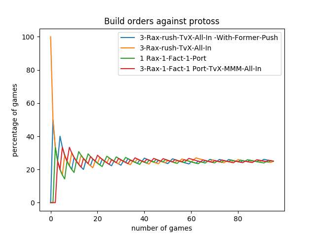
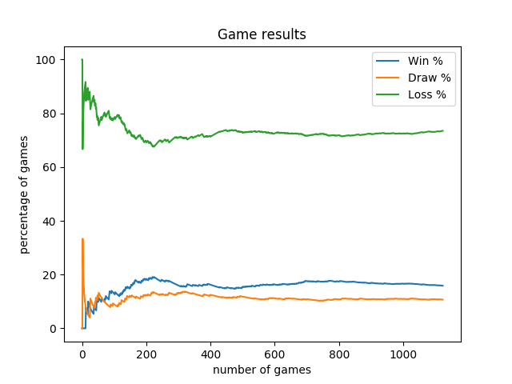
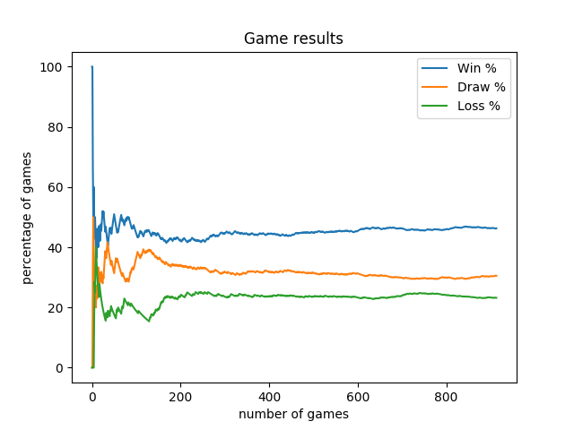
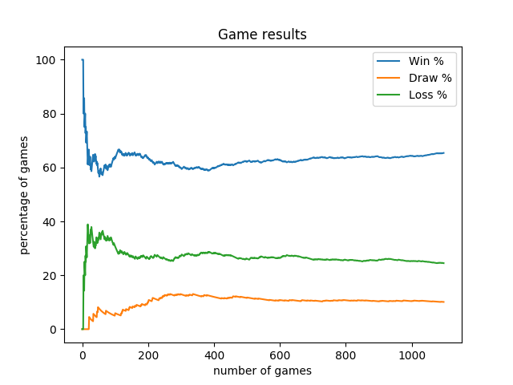

Multi Reinforcement Agent (Machine Learning)
============================================

This agent uses the same Q-Learning approach than the [Reinforcement Attack Agent](reinforcement_attack_agent.md).

However, it has several learning models, each being specialized into a different phase.

```
$ python3.6 -m pysc2.bin.agent --map Simple64 --agent nidup.pysc2.agents.MultiReinforcementAgent --agent_race T --max_agent_steps=3000000  --difficulty 3
```

**All the following results are collected playing against [medium built-in AI](https://github.com/deepmind/pysc2/blob/master/pysc2/env/sc2_env.py#L51)**

Variants & Evolution (Sequential Build Order + Assisted Timing Push + Attack Training per Race)
-----------------------------------------------------------------------------------------------

Also known as "3-Rax-rush-TvX-All-In -With-Former-Push" build orders.



```
Results on the 100 last games:
race	total	win	draw	loss	win %	draw %	loss %
zerg	32	12	4	16	37.5	12.5	50.0
terran	32	5	0	27	15.62	0	84.38
protoss	30	1	0	29	3.33	0	96.67
```

Variant & Evolution (QLearning to Choose a Build Order per Race)
----------------------------------------------------------------

We add the capability to scout the race very soon in the game, the BuildOrdersCommander is able to choose a build orders.

We re-enforce the choose of a build orders by rewarding on the episode victory.

We also introduce the capacity to build hellion & medivac.

This change makes the attack space bigger and it can slow down a lot the attack training or results into very disparate army compositions.

In the future, we could split the attack QLearning system to:
 - split training units actions & attack actions
 - reduce the training units state & actions by specializing by build orders

A new report allows to see the progress of the use of each build orders in time for each race.

```
Results on the 100 last games:
race	total	win	draw	loss	win %	draw %	loss %
zerg	38	10	1	27	26.32	2.63	71.05
terran	30	3	0	27	10.0	0	90.0
protoss	32	0	0	32	0	0	100.0
```

We can see interesting changes, from the selection of certain build orders for Zerg and Terran:



And also a equivalent use of any build orders against Protoss (as the agent loose every episode against this race):




Variant & Evolution (QLearning on Build Orders, Units Training, Attack Quadrants, Attack Base)
----------------------------------------------------------------------------------------------

We split here the QLearning as 4 dedicated "brains":
 - Build Orders (BO) choice depending on race, rewarded on the game results
 - Training of units depending on race and selected BO, rewarded on the game results
 - Attack of one of the four game quadrants rewarded on destroyed buildings
 - Attack in a game quadrant rewarded on destroyed buildings & unit

We observe here the agent struggles to learn, as it looses way too much games, it seems does not learn good enough pattern.

Watching replays we see it attacks by very small waves of units that are progressively detroyed.

Then it looses the episode due to a enemy's push or economically because enemy builds a B2 and sometimes B3.



```
Results on the 100 last games:
race	total	win	draw	loss	win %	draw %	loss %
zerg	32	4	2	26	12.5	6.25	81.25
terran	30	1	4	25	3.33	13.33	83.33
protoss	38	3	1	34	7.89	2.63	89.47
```

Variant & Evolution (Time Matters & Goal Oriented Agent)
--------------------------------------------------------

One major issue we observe it to try to learn from a not finished action or set of actions (aka order).

For instance, when attacking a game quadrant, the army has to go there before to do any damage and the reward should be applied only once the order really done, not when the army is still moving to the destination.

It shows a major flaw in the current system, the notion of is an order is really finished? how to detect an order has been taken in account? how to detect the order is finished?

It leads to introduce a time notion which makes everything more complex.

For this notion we can use episode steps, more information can be [found here](https://github.com/deepmind/pysc2/blob/master/docs/environment.md#game-and-action-speed).

Another though is that we should be able to learn on more high level items than orders.

Each order is a set of atomic player's action (select barracks + train marine) and can be seen as tactics items.

We introduces the concept of goals, a set of ordered orders, like:
 - BuildOrder
 - ReinforceArmy
 - AttackQuadrant

It allows to train the agent on the result of these goals on not on each atomic order or even worse atomic action.

As POC, to validate the concept, we replace the BuildOrder & Training Commanders by a simple GoalCommander, keeping Scout, Worker and Attack Commanders

The results are pretty good even if they results into lot of draw episodes.

Watching replays, we see the benefits of training on larger set of actions.



```
Results on the 100 last games:
race	total	win	draw	loss	win %	draw %	loss %
zerg	35	22	9	4	62.86	25.71	11.43
terran	32	13	12	7	40.62	37.5	21.88
protoss	33	11	16	6	33.33	48.48	18.18
```

Variant & Evolution (Seek 'n' Destroy Attack Order)
---------------------------------------------------

We used several ways to attack inside a minimap quadrant.

From a random attack in a set of 9 offsets, to trained on 4 squares heat map to chose one of the 9 offsets.

We re-work here the Attack order to add a Seek 'n' Destroy implementation that drop the offset concept to attack just near a building when there is one.

We don't attack the building in itself as it results into our army being destroyed during the building attack.

After 800 episodes of training:

```
Results on the 100 last games:
race	total	win	draw	loss	win %	draw %	loss %
zerg	31	21	4	6	67.74	12.9	19.35
terran	35	13	8	14	37.14	22.86	40.0
protoss	34	7	6	21	20.59	17.65	61.76
```

Variant & Evolution (Improved Attack Commander)
-----------------------------------------------

We noticed that the way to learn which of the 4 minimap quadrants to attack is far to be optimal.

We re-work the Attack commander, changing the attack quadrant state:
 - add the enemy's race (noticing that in time, the agent become better against a race, then worst when improving against another race)
 - change the quadrants heat map to mark as hot only when there are buildings and not all enemy units
 - replace the army food info (0 to 200) by a simplified army size info (0 to 40) to accelerate the learning

We also change the available attack actions, allowing to attack on 4 minimap quadrants (adding the player base 1).

Finally, we change the reward to go back to a sparse reward on final result and not on destroyed enemies per order.

Here is the results after 800 episodes of training:

```
Results on the 100 last games:
race	total	win	draw	loss	win %	draw %	loss %
zerg	35	29	2	4	82.86	5.71	11.43
terran	36	17	8	11	47.22	22.22	30.56
protoss	29	16	3	10	55.17	10.34	34.48
```

We notice as expected, better results against each race that the agent is doing less draw games.

Often, the draw games happened because of letting a single enemy's building somewhere even if already destroyed all others units.

Let's dive into draw episodes:

```
Average Results on the 1000 last games:
result	total	last step	idle worker	kill struct	kill unit	score
win	517	1897		372		3582		4993		7814
draw	160	3582		6675		4588		7239		9395
loss	323	1981		1672		158		2123		2056
```

We observe draw games share a similar set of characteristics with won games.

Except, they finish in average on the very last episode step means the game is stopped by the server.

We also note a huge amount of idle worker time which is explained by the fact that the agent collected all the minerals and don't know yet how to build a second base.

In fact, the Worker Commander is responsible of it, as it tries to send idle worker back to a mineral field even if there is no more.

As this commander has a higher priority than the attack commander, once all base 1 minerals collected, it does not let play the attack commander.

As these games are not lost, we can suppose the agent is in a very good shape to win the game but does not do very final attacks.

Variant & Evolution (Improved Worker & Goal Commanders)
-------------------------------------------------------

We add a condition in the SendIdleSCVToMineral order, to make it doable only if there is still mineral fields.

We also reduce the amount of orders allowing to center the camera on command center.

We change the goal commander to allow him to switch to a attack only mode once there is no more mineral to collect.

Before the change:

```
Results on the 100 last games:
race	total	win	draw	loss	win %	draw %	loss %	last step avg
zerg	37	29	3	5	78.38	8.11	13.51	1843
terran	30	14	5	11	46.67	16.67	36.67	2545
protoss	33	14	7	12	42.42	21.21	36.36	2195

Average Results on the 100 last games:
result	total	last step	idle worker	kill struct	kill unit	score
win	57	1876		307		3711		4961		7893
draw	15	3598		6595		4823		9137		9352
loss	28	2004		2016		289		2496		2134
```

After these changes, we observe just a bit less draw games:

```
Results on the 100 last games:
race	total	win	draw	loss	win %	draw %	loss %
zerg	37	34	2	1	91.89	5.41	2.7
terran	34	14	9	11	41.18	26.47	32.35
protoss	29	7	2	20	24.14	6.9	68.97

Average Results on the 100 last games:
result	total	last step	idle worker	kill struct	kill unit	score
win	55	1914		412		3547		4965		7653
draw	13	3599		5869		5129		8869		6953
loss	32	2029		1864		295		2593		1899
```

We observe that in the late game, we spam a lot of attack orders but not queuing them which results to almost freeze the army.

On other hand, when we queue attack order, it results into a very spread army that cross along a path of points to attack.

We need to balance this phase more properly, during the early game, we attack a single point in a quadrant (and not 10 not queued):

```
Results on the 48 last games:
race	total	win	draw	loss	win %	draw %	loss %
zerg	21	20	0	1	95.24	0	4.76
terran	12	2	2	8	16.67	16.67	66.67
protoss	15	8	2	5	53.33	13.33	33.33
```

Moving from 1 not queued to 3 queued building attack positions.
 
When entering the late game with no more minerals, continue to regularly do attack quadrants.

```
Results on the 100 last games:
race	total	win	draw	loss	win %	draw %	loss %
zerg	32	27	1	4	84.38	3.12	12.5
terran	27	9	6	12	33.33	22.22	44.44
protoss	41	21	8	12	51.22	19.51	29.27
```

Once all these changes made, we re-train our agent from scratch on more than a thousand of games.



We see here clear benefits, far less draw games and pretty solid results against Zerg & Terran, Protoss is still the more complex race to beat for our agent.

```
Results on the 100 last games:
race	total	win	draw	loss	win %	draw %	loss %
zerg	27	25	2	0	92.59	7.41	0
terran	42	34	2	6	80.95	4.76	14.29
protoss	31	17	3	11	54.84	9.68	35.48

Average Results on the 100 last games:
result	total	last step	idle worker	kill struct	kill unit	score
win	76	1905		454		3886		5174		8106
draw	7	3599		6430		6904		9889		9543
loss	17	2125		1680		216		3124		2080
```

However, digging into the logs, we still observe that in case of draw games, the agent seems in a strong position to win but does not manage to attack relevant minimap quadrants to win the game.

As we use the same in game attack strategy which relies on visible buildings on the minimap, it may totally miss a single lost enemy unit or a single building not visible on minimap.
