Hybrid Reinforcement Attack Agent (Machine Learning)
====================================================

This agent uses the same Q-Learning approach than the [Reinforcement Marine Agent](reinforcement_marine_agent.md).

However, the learning is specialized on the train units & attack phase.

On the other hand, the build order phase is scripted to reduce the set of actions and focus the training on the attack.

```
$ python3.6 -m pysc2.bin.agent --map Simple64 --agent nidup.pysc2.agents.HybridAttackReinforcementAgent --agent_race T --max_agent_steps=1000000
```

Variants & Evolution (Marines only)
-----------------------------------

**Against [very-easy built-in AI](https://github.com/deepmind/pysc2/blob/master/pysc2/env/sc2_env.py#L51)**

Playing against the default built-in AI (very-easy difficulty).

Build order with 2 supply depots & 2 barracks (same than previous agent):

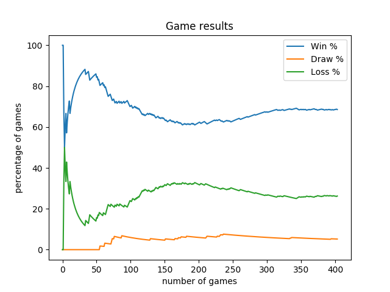

Build order with 4 supply depots & 2 barracks to avoid supply limit and loss in mid-game:

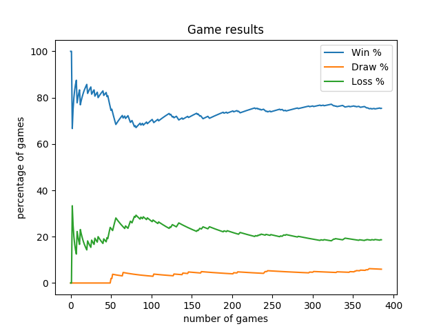

Build order with 10 supply depots & 4 barracks, ie, the marines ball:

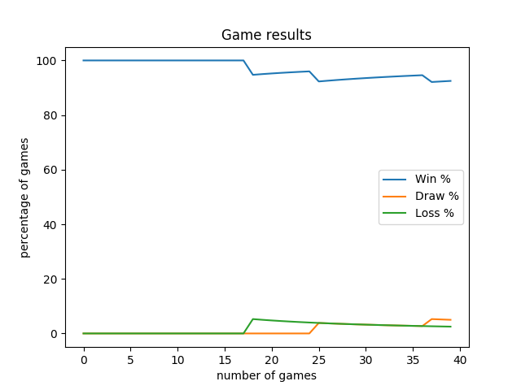

**Against [easy built-in AI](https://github.com/deepmind/pysc2/blob/master/pysc2/env/sc2_env.py#L51)**

```
python3.6 -m pysc2.bin.agent --map Simple64 --agent nidup.pysc2.agents.HybridAttackReinforcementAgent --agent_race T --max_agent_steps=1000000 --difficulty 2 -norender
```

Build order with 10 supply depots & 4 barracks, ie, the marines ball:

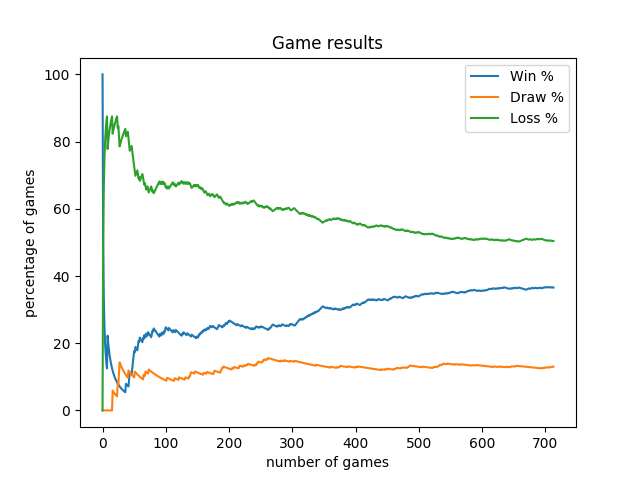

**Against [medium built-in AI](https://github.com/deepmind/pysc2/blob/master/pysc2/env/sc2_env.py#L51)**

```
python3.6 -m pysc2.bin.agent --map Simple64 --agent nidup.pysc2.agents.HybridAttackReinforcementAgent --agent_race T --max_agent_steps=1000000 --difficulty 3 -norender
```

Build order with 10 supply depots & 4 barracks, ie, the marines ball:

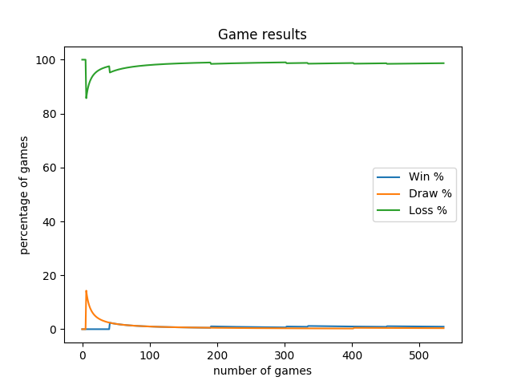


Variants & Evolution (Marines and Marauders)
--------------------------------------------

**Against [easy built-in AI](https://github.com/deepmind/pysc2/blob/master/pysc2/env/sc2_env.py#L51)**

Build order with 8 supply depots & 4 barracks & 2 refinery & 1 factory & 1 techlab barracks, ie, the MM ball:

The build order is sequential and has to be finished to let the train & attack phase starts.

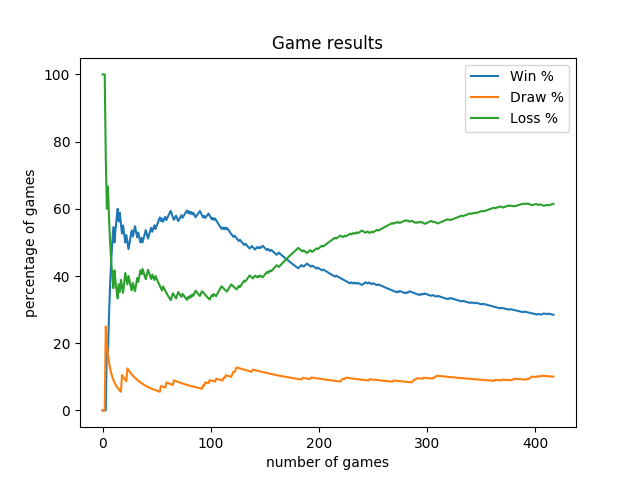

The same build order, updated to make the build of the supply depots triggered only when needed:

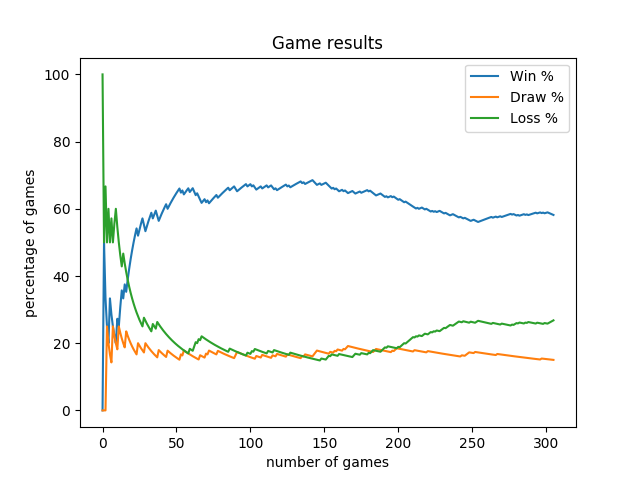

**Against [medium built-in AI](https://github.com/deepmind/pysc2/blob/master/pysc2/env/sc2_env.py#L51)**

The same build order, updated to make the build of the supply depots triggered only when needed:

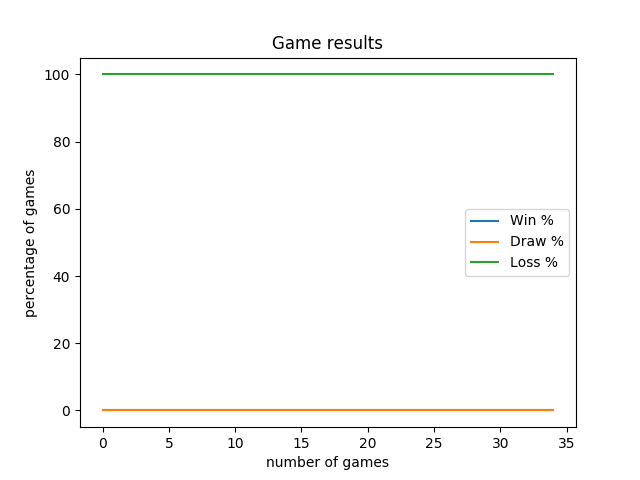


Variants & Evolution (Worker Commander)
---------------------------------------

**Against [easy built-in AI](https://github.com/deepmind/pysc2/blob/master/pysc2/env/sc2_env.py#L51)**

Build order with 8 supply depots & 4 barracks & 1 refinery & 1 factory & 1 techlab barracks, ie, the MM ball.

A worker commander has been added to:
  - fill each built refinery with 3 VCS
  - build as much VCS than VCS affected to gather vespene
  - be able to build extra VCS (4 has been added on this build)

At each step, the hybrid commander:
  - ask to the worker commander if it has an order
  - if not, it aks to the build order commander
  - if not, it asks to the the attack commander

The drawback is a slower start of the game due to blocking orders from the worker commander and the build order commander.

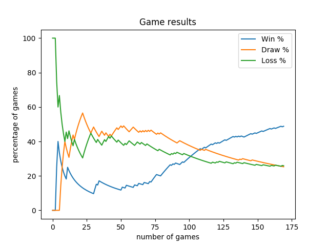

Build order with 8 supply depots & 3 barracks & 1 refinery & 1 factory & 1 techlab barracks & 1 reactor barracks, ie, the MM ball.

Very close build order but making the worker commander plays only every 30 game steps.

The worker commander gives orders to improve the production, it's less important than build order and attack commanders and can be called less often to accelerate the early game execution.

The build order commander has also been updated to return only executable orders and avoid to spend long time having enough resource to start to build a building for instance.

These changes allows to harass sooner the enemy.

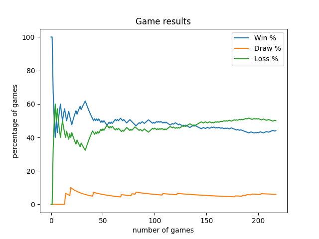

Same variant but with a slightly different build order, 8 supply depots & 4 barracks & 1 refinery & 1 factory & 1 techlab barracks & 1 reactor barracks, ie, the MM ball.

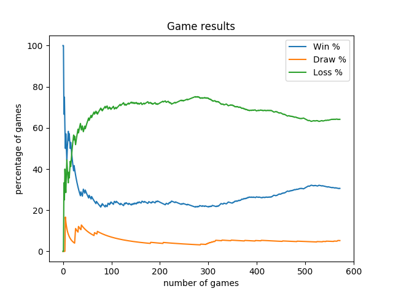

Variants & Evolution (Sequential Build Order)
---------------------------------------------

Introducing a sequential build orders to replace the trigger build orders.
The build order is 1 refinery & 3 barracks & 1 techlab & 2 reactors.
We also add some research like concussive shells and combat shields.

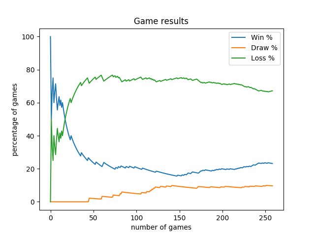

Variants & Evolution (Sequential Build Order + Assisted Timing Push)
--------------------------------------------------------------------

**Variant 1**

Changing the hybrid commander to delegate to attack commander only once the build orders is finished.

Here, the build orders trains 6 marines & 3 marauders before to let the attack commander continues the game.

This way, the attack commander starts with a first timing push, then constantly harass by training & attacking.

When the army grow and the supply depots limit is raised, a new depot is automatically built.

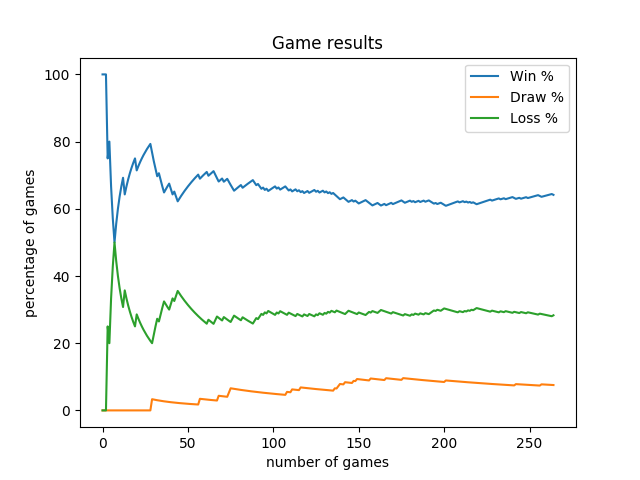

**Variant 2**

Re-enforcing the first push with 4 Marines and 2 Marauders for a bigger first push:

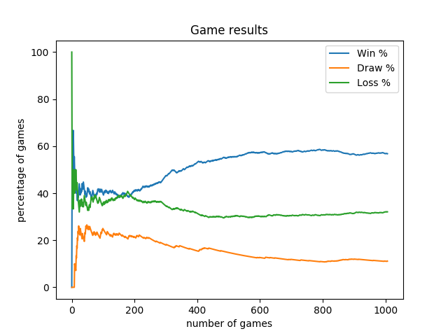

**Variant 3**

Fixing a bug in the QLearning state build leading to mis-learning and going back to 6 marines & 3 marauders timing push.

Results are excellent there (the full training took Took 30191.962 seconds, ~8 hours for 2000000 steps).

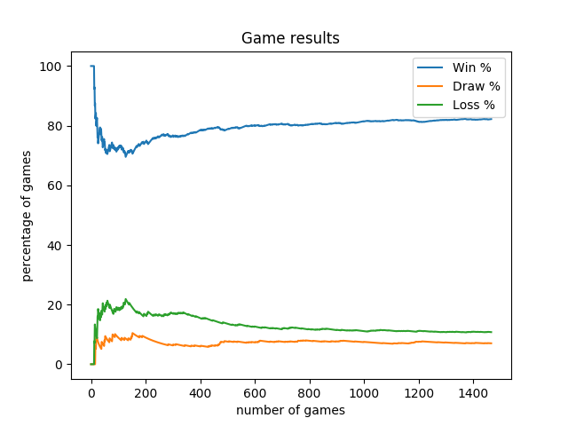

We can notice that this variant results slightly depends on the enemy's race.

Very good against zerg, good against human, less good against protoss, here are the results for each race.

A future evolution of the agent could definitely be to have a learning system depending on races.

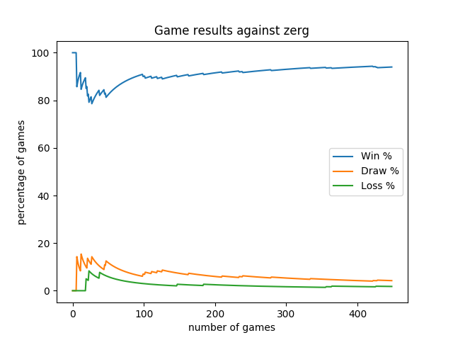

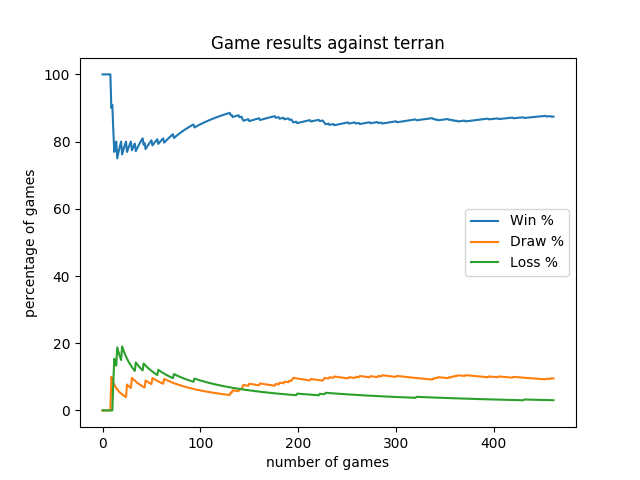

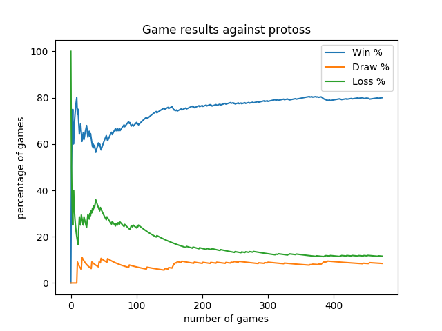

Variants & Evolution (Sequential Build Order + Not Assisted Timing Push)
------------------------------------------------------------------------

We see that the agent quickly learns how to do an efficient timing push.

In this variant, we remove the training of marines & marauders from the build order and we let the agent fully decides when to do the first timing push with how many units.

The result is almost as good as with the assisted timing push:

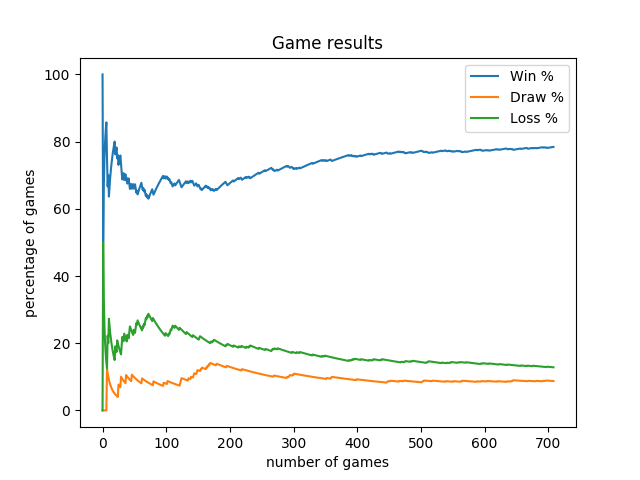

We can still see disparity in game results per race and see that these results change during the training, getting better for a race then worst for this race later on but better for another race.

```
Results on the 100 last games:
race	total	win	draw	loss	win %	draw %	loss %
zerg	29	24	4	1	82.76	13.79	3.45
terran	40	39	1	0	97.5	2.5	0.0
protoss	28	22	4	2	78.57	14.29	7.14
```

Variants & Evolution (Sequential Build Order + Not Assisted Timing Push + Attack training per race)
---------------------------------------------------------------------------------------------------

Let's keep the same variant but completing the QLearning state to add the enemy race inside.

The race can be unknown in early game, then zerg or protoss or terran.

This change leads to a longer initial training but a more specialized attack agent.

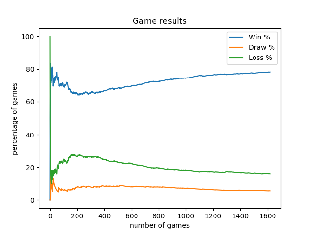

The results are quite similar, maybe because our agent does not have enough actions to make better strategy distinction or maybe because we're already getting closer to 90% against any race once the agent trained.

```
Results on the 100 last games:
race	total	win	draw	loss	win %	draw %	loss %
zerg	24	23	0	1	95.83	0	4.17
terran	38	35	1	2	92.11	2.63	5.26
protoss	33	28	0	5	84.85	0	15.15
```

