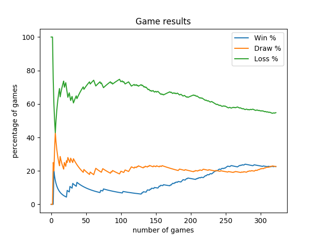
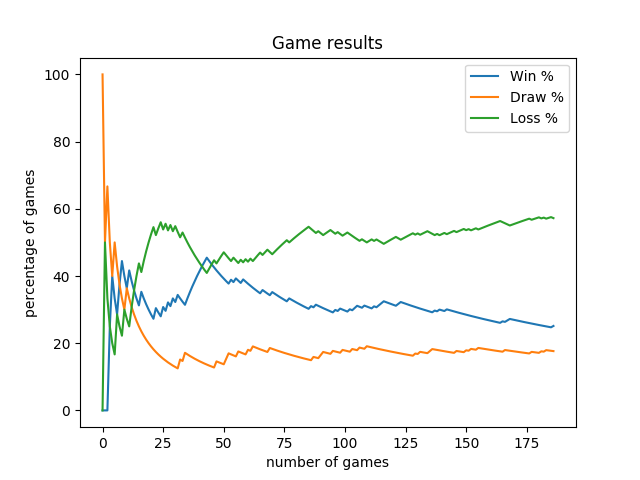
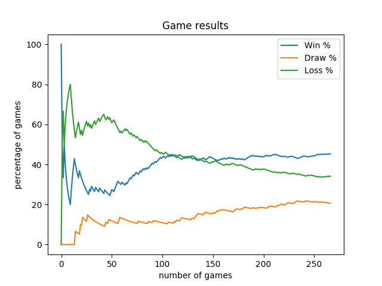
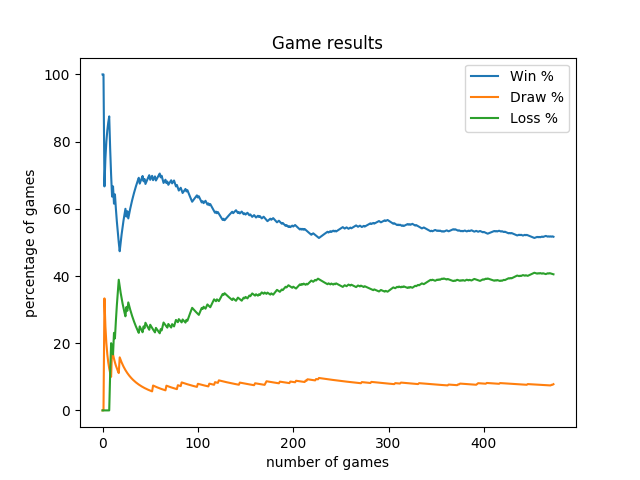

Reinforcement Marine Agent (Machine Learning)
=============================================

Explanation
-----------

This agent is formerly [based on these tutorials](https://itnext.io/build-a-sparse-reward-pysc2-agent-a44e94ba5255)

It uses QLearning table on a reduced set of actions, build supply depot, barrack, train marine, attack on part of the map.

It has been fine tuned to be trained faster and win more games against the built-in AI.

Train
-----

Train the agent by playing a lot of games:
```
$ python3.6 -m pysc2.bin.agent --map Simple64 --agent nidup.pysc2.agents.ReinforcementMarineAgent --agent_race T --norender --max_agent_steps=1000000
```

The option `--norender` can be added to disable the rendering and play game faster.

The option `--max_agent_steps` can be added to make the agent play longer. The default value is 2500.

On my laptop, with no render, running on CPU,
 - 100k agent steps ~= 30 episodes ~= 30 minutes
 - 400k agent steps ~= 144 episodes ~= 100 minutes

The reward history and final QLearning Table are stored in `data` folder using a different file per agent.
The file is suffixed by `_qlearning` and contains a pandas DataFrame.
This archive is re-used when it exists, you can drop it to train the agent from scratch.

Run
---

After the reinforcement, you can run it:

```
$ python3.6 -m pysc2.bin.agent --map Simple64 --agent nidup.pysc2.agents.ReinforcementMarineAgent --agent_race T
```

Evolution
---------

Attacking 4 quadrants:



Attacking 3 quadrants (not player's base quadrant):



Attacking only enemy quadrant:



Attacking only enemy base 1 and base 2 quadrants:


